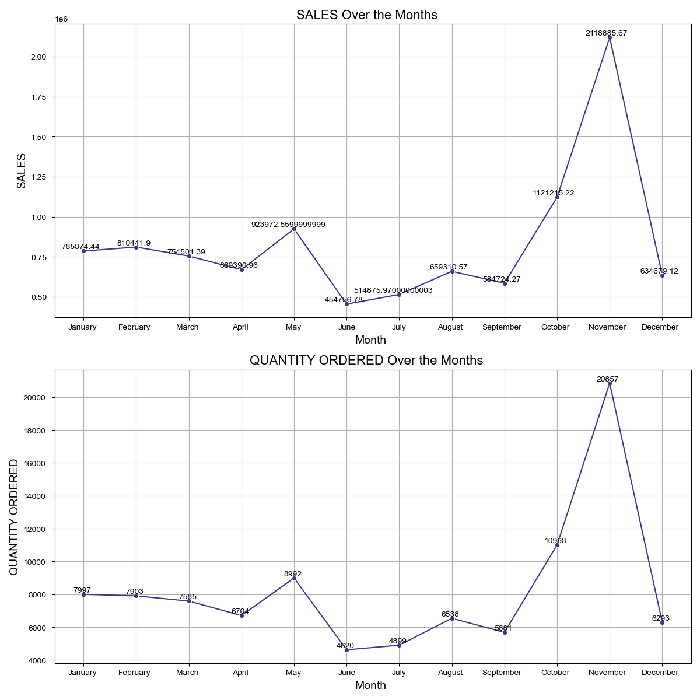
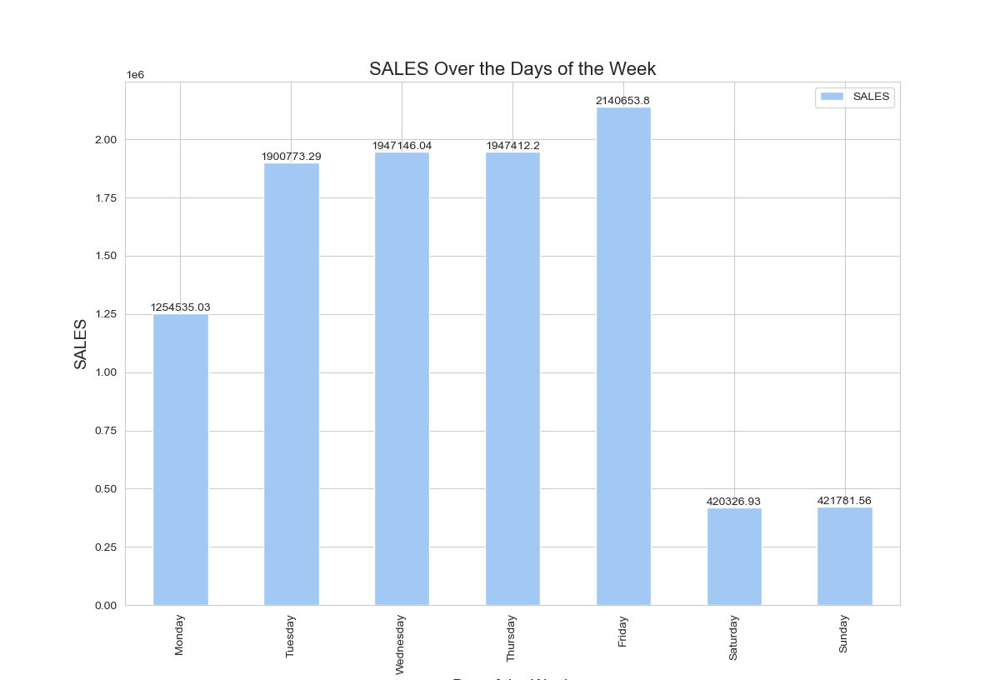
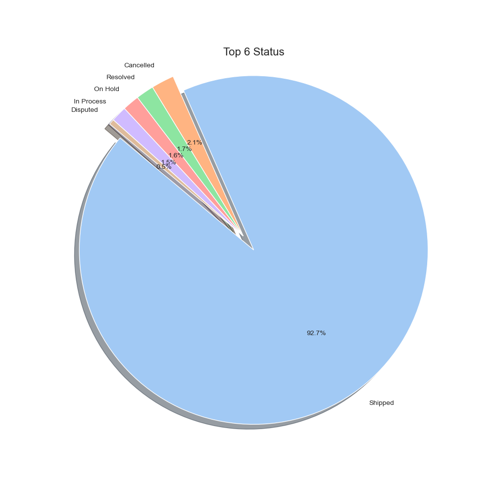
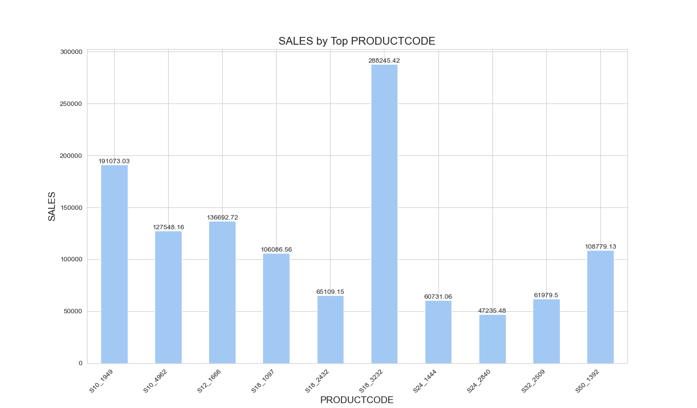
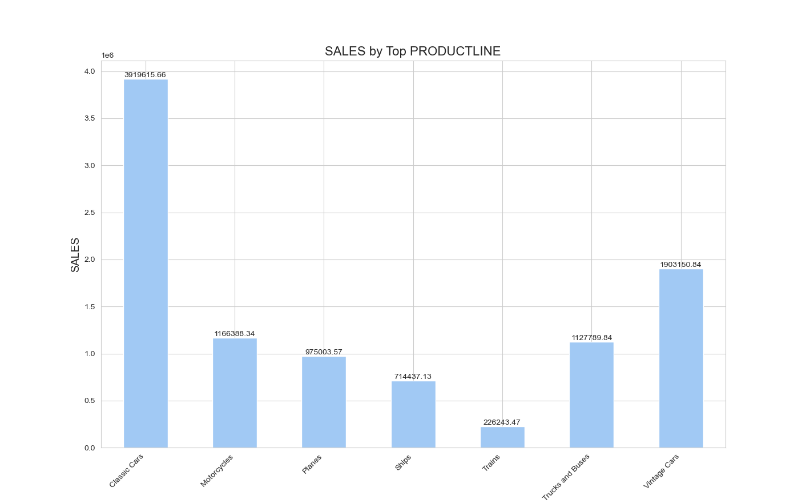
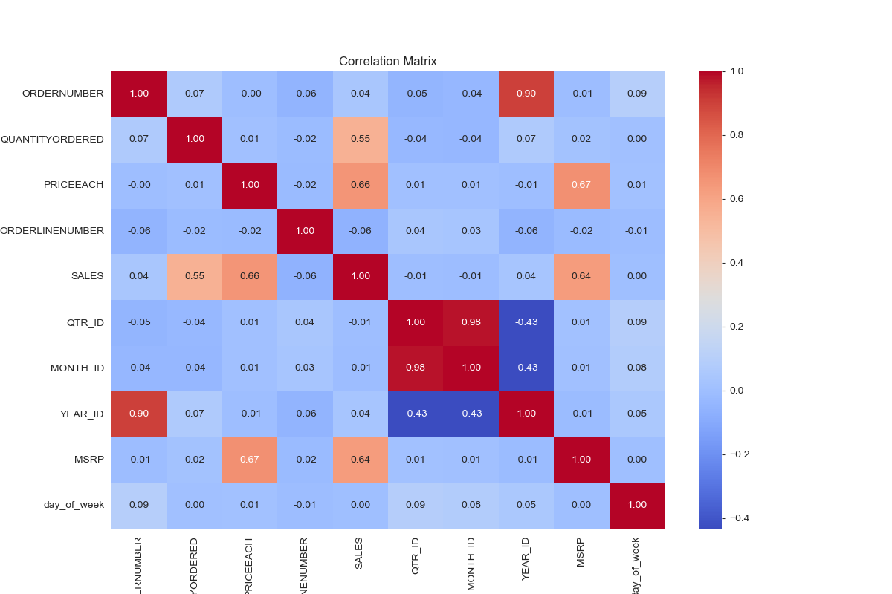
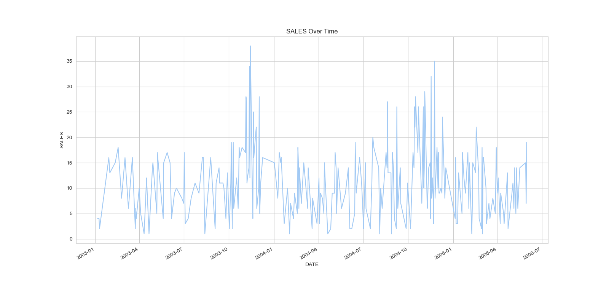

# Simple Analysis of Sales Data
Sample Sales Data, Order Info, Sales, Customer, Shipping, etc., Used for Segmentation, Customer Analytics, Clustering and More. Inspired for retail analytics. This was originally used for Pentaho DI Kettle, But I found the set could be useful for Sales Simulation training.
Sample Sales Data, Order Info, Sales, Customer, Shipping, etc., Used for Segmentation, Customer Analytics, Clustering and More. Inspired for retail analytics. This was originally used for Pentaho DI Kettle, But I found the set could be useful for Sales Simulation training.

## Analysis Base
As we navigate through this presentation, we'll unravel intricate temporal trends, we will explore the dataset, and perform statistical analyses to uncover key insights into the factors influencing the sales.

## Visualizition Analysis

*This chosen visualization method provides a smooth narrative of how sales fluctuate throughout the years*

*We turn our attention to the distribution of sales over days of the week*

*A pie chart gracefully unveils the prominence of the top 10 status. Each slice represents a unique status.*

*Zooming in on specific Product Codes, we curated a bar plot focusing on the top N Codes. This strategic approach avoids overwhelming visual clutter and allows us to pinpoint the most common codes.*

*Zooming in on specific Product Lines, we curated a bar plot focusing on the top N Lines. This strategic approach avoids overwhelming visual clutter and allows us to pinpoint the most common Lines.*

*Transitioning to statistical analysis, we delve into the correlation matrix of numerical variables. This intricate web of correlations provides an understanding of how different aspects of Sales data interrelate.*

*For a dynamic perspective, our time series plot unfurls the temporal patterns in sales. *

